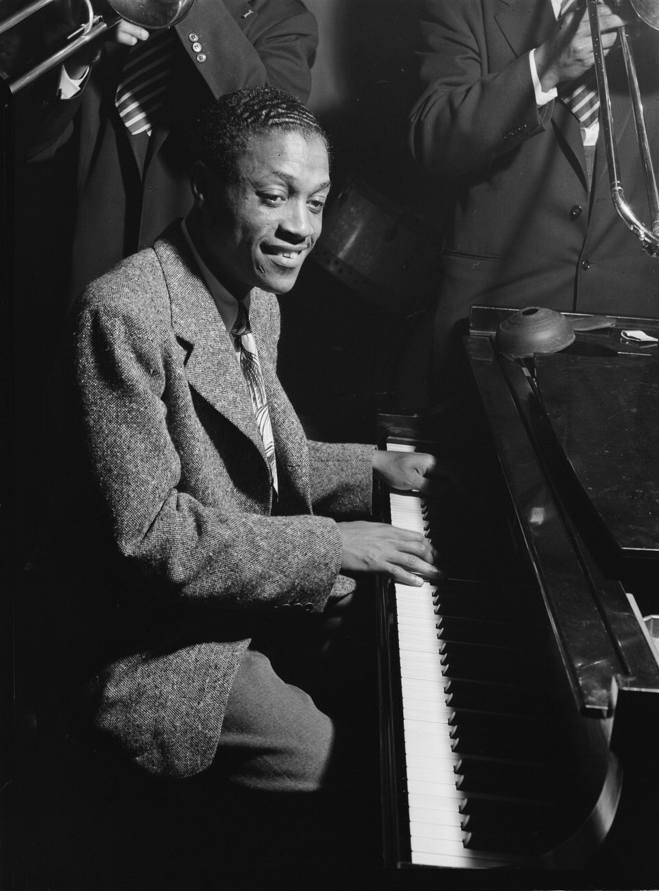

<style>
   pre { border: 0;}
</style>

# Introduction: "All of Me"

This is the introduction

## March 21, 1941

On March 21, 1941, Billie Holiday and a band of eight musicians recorded four songs in a Columbia recording studio at 799 Seventh Avenue in New York City. 

The band, billed as “Eddie Heywood and His Orchestra,” was led by pianist Heywood, who was probably also the arranger; it was Holiday’s first session with him. The star instrumental soloist was the great tenor saxophonist Lester Young. The session took place just 17 days before Holiday’s 26th birthday.

```{r echo=FALSE, out.width = "50%", fig.align='center', fig.cap="Eddie Heywood"}

```

The four songs recorded on the session were Cole Porter’s “Let’s Do It”; Hoagy Carmichael’s “Georgia on My Mind”; the now nearly forgotten “Romance in the Dark” from 1938; and “All of Me,” by Seymour Simons and Gerald Marks, written in 1931. Today I will focus on “All of Me.” (For details about the recording session, I’ve used the excellent online Billie Holiday Discography, put together by the young Dutchman Mike Lubbers.)

## The First Four Bars

### Transcriptions

### Spectrograms

### Analysis

## Alternate Takes

## Discussion

## This Book


